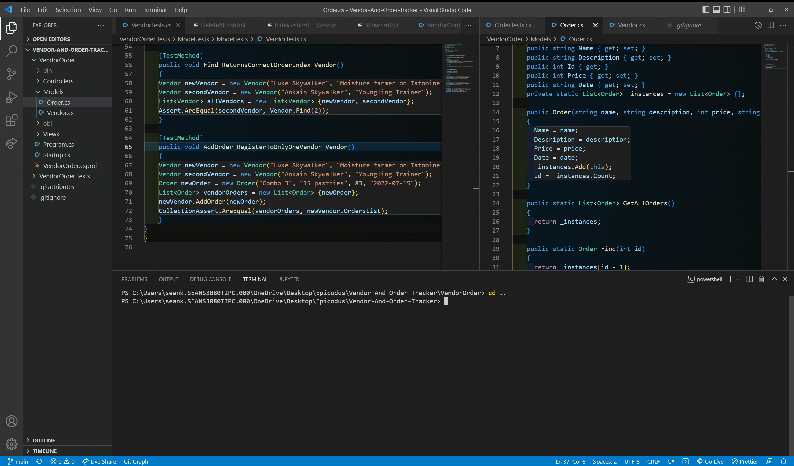
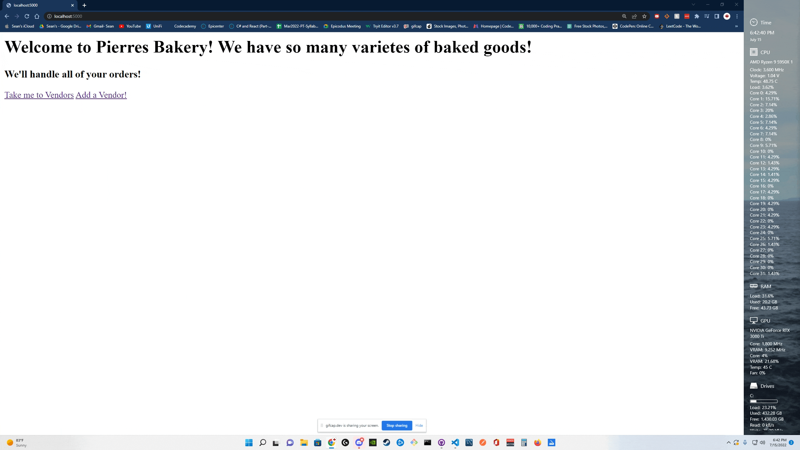

# _Vendor/Order Tracker for Pierre's Bakery_

#### By _**Sean Keane**_

#### Vendor and Order Tracker - Epicodus Code Review 7/15/2022

## Technologies Used

* C#
* .NET 5.0
* ASP.NET Core MVC
* MSTest

## Description
_This is a project I created at Epicodus that allows Pierres Bakery to track his vendors and orders.  The user is presented with a "Splash Page" and has the options of selecting current vendors or the ability to add a vendor. The user has the ability to add information about the Vendor, along with attributing values to the vendor.  These values include the order name ID, Information about the vendors order, total cost, and date the order was placed. Developing this application helped grow my understanding of C#, .NET, ASP.NET Core MVC, and Testing with C#._

## Setup/Installation Requirements

1) Clone this repository to your desktop.
2) Navigate to the now installed directory and open in your editor of choice.
3) Open the directory and `cd to VendorOrder`.
4) To build Pierre's Bakery enter: `dotnet build`.
5) To run Pierre's Bakery enter: `dotnet run`.
6) Open your browser of choice and use the url: http://localhost:5000/

## For a visual representation of Setup, please consult the attached Gifs.

## Project can be found at:
https://github.com/CanadianRunner/Vendor-And-Order-Tracker.git

## Known Bugs

* This application currently has no styling. If time permits I would like to add some visual appeal to this vendor and order tracker.

## License

If you have any questions or concerns feel free to contact me at code@sean-keane.com

*This is licensed under the MIT license*

Copyright (c) 7-15-2022 **_Sean Keane_**

